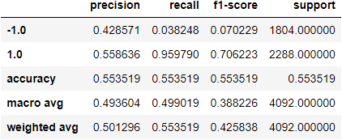
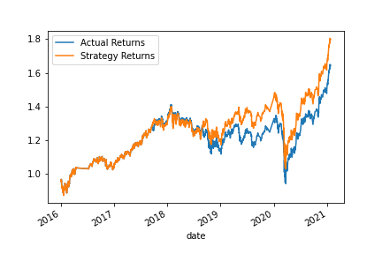
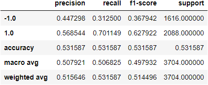
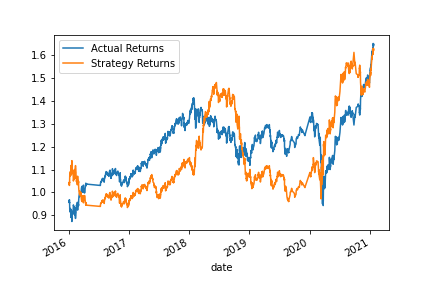
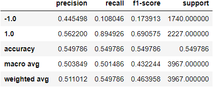
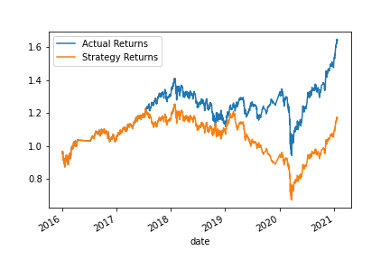
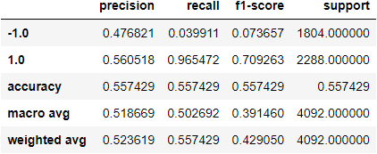
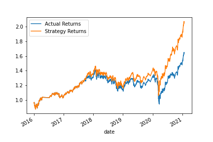

# Algorithmic Trading

Improving an algorithmic trading system to maintain competitive advantage.

Using machine learning to predict buy and sell signals.

Historical data is read from a CSV file and prepared for machine learning by reorganising, splitting and scaling. 

## Baseline Trading Algorithm

The first model uses the support vector machine (SVM) method to fit the training data and predict buy and sell signals on test data. The first 3 months of data are used to train the model.

Signals are added to the data to buy long when the return is positive and sell short when negative.

The model uses short and long-window simple moving averages (SMAs) to predict the future buy and sell signals. 

The classification report below shows the performance of the model on the test data. The accuracy is low at 55%. The model does well at predicting when there will be positive returns (long buys) but is terrible at predicting the negatives (short sales).

The below chart shows the returns based on the predictions on the test data provided. 

Because the model did so well at predicting the positive movements, the streategy result provides an increased return compared to the actual returns. This is only true because the trend of the return overall is positive. Given the recall of negatives in this model, if the stock price were to trend downwards, the strategy return would be exponentially lower that the actual returns.

## Tuning the Algorithm
### Changing the duration of training data

Rerunning the model with 9 months of training data slightly reduces the overall accuracy of the model and the precision scores for each class are similar.

The recall worsens from 95% to 70% for the positives but increases from 3.8% to 31.25% for the negatives.

The impact on the strategy returns can be seen in the chart below. The model appears skewed by the negative returns in the second half of 2016 and sits below the actual returns for a large portion of the time period. 

### Changing the duration of the moving averages
Reverting to 3 months of training data and changing the period of the short and long windows for the SMAs from 4 and 100, to 10 and 200 days, slightly increases the overall accuracy and the precision of the model. The recall on the negatives remains poor.

The chart shows that the strategy tracks the actual returns well for the first couple of years but then significantly underperforms.

### Conclusion of Tuned SVM

The best returns were generated by the original model, with a 3 month training period and SMAs of 4 and 100 days.

Note, the time periods of the cumulative returns have been normalised to start from 1 Jan 2016 for all models.

## Alternative Model

As an alternative to the SVM method, a new model was created using the Gaussian Naive Bayes method.

The model performed comparibly to the baseline and tuned models in terms of accuracy, precision and recall.

The model tracked the actual returns for the first 2 years then began to outperform, resulting in the highest return of the tested models.

